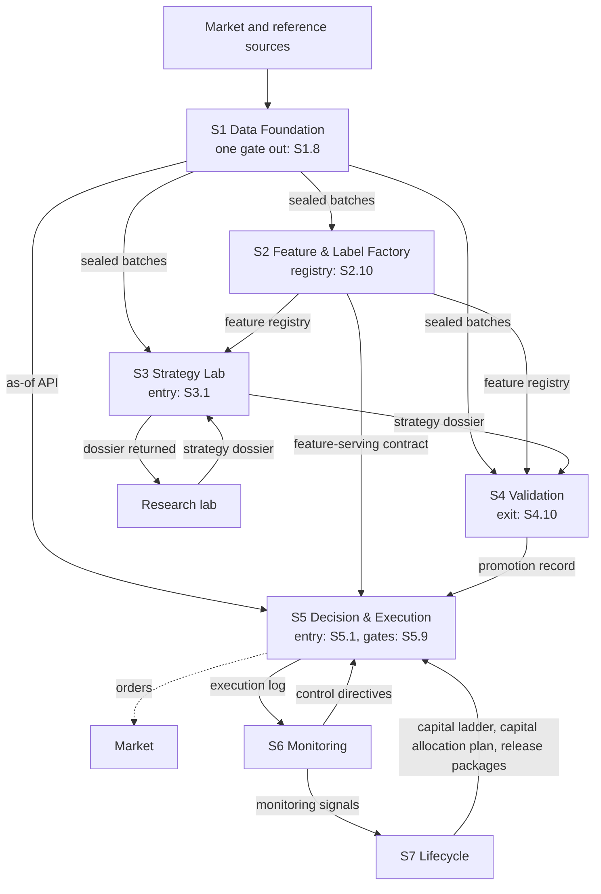

[Up: Alpha Factory](../README.md)

# Factory — the blueprint

## TL;DR

The blueprint of an institutional systematic trading pipeline, from raw data to the lifecycle of live strategies.
Seven sections and 64 sub-sections, each broken down into gates, steps and deliverables: designed, not built.
Strategies arrive from the research lab as a complete dossier, and the factory re-validates them before any capital.

## The factory in two minutes

The [architecture](architecture.md) explains this drawing, its solid and dashed arrows, and follows
each path in detail.

1. **Data.** Market and [reference data](glossary.md#reference-data) become one
   [point-in-time](glossary.md#point-in-time) record of what was known when, which
   [replays](glossary.md#replay) any past day bit for bit; nothing leaves section 1 except through
   its [gate](glossary.md#gate) ([S1.8](sections/s1-data-foundation/s1.8-data-governance.md)).
2. **Features.** Section 2 turns that data into [features](glossary.md#feature),
   [labels](glossary.md#label) and weights a model can learn from, with no leak from the future, and
   serves research and production the same computation.
3. **Intake.** A strategy arrives from the research lab as a complete dossier. Section 3 admits it
   ([S3.1](sections/s3-strategy-lab/s3.1-admission.md)), re-implements it on the factory's data and
   sends it back if it does not reproduce
   ([S3.2](sections/s3-strategy-lab/s3.2-architecture-invariances.md)), then improves it under a
   declared budget of trials.
4. **Judgment.** Section 4 judges what section 3 improved: statistical validity,
   [robustness](glossary.md#robustness), costs, simulated execution and
   [paper trading](glossary.md#paper-trading). Its [promotion gate](glossary.md#promotion-gate)
   ([S4.10](sections/s4-validation/s4.10-promotion-gates.md)) signs go or no-go.
5. **Capital and orders.** Section 5 turns approved strategies into a portfolio, budgets of risk and
   [capacity](glossary.md#capacity), and orders executed at controlled cost, under the rules, limits
   and [kill switch](glossary.md#kill-switch) of its governance
   ([S5.9](sections/s5-decision-execution/s5.9-governance-safety.md)).
6. **Watching.** Section 6 watches data, models, execution and security in production, degrades
   safely when something [drifts](glossary.md#drift), and acts on section 5 through
   [control directives](glossary.md#control-directive).
7. **Steering.** Section 7 steers the whole over time: the record of every decision, releases, the
   status and capital of each strategy, incidents, and the missions that improve the factory.

## The seven sections

| Section | What it does |
|---|---|
| [S1 · Data Foundation](sections/s1-data-foundation/README.md) | Point-in-time market and reference data: who each instrument is, what was known when, and an exact replay of any past day. |
| [S2 · Feature & Label Factory](sections/s2-feature-label-factory/README.md) | Turns data into features and labels a model can learn from, sampled and weighted so that the future never leaks into the past. |
| [S3 · Strategy Lab](sections/s3-strategy-lab/README.md) | Admits the research lab's [strategy dossier](glossary.md#strategy-dossier), re-implements it on factory data and improves it under a declared [trial budget](glossary.md#trial-budget). |
| [S4 · Validation, execution simulation, cost analysis, paper trading](sections/s4-validation/README.md) | The counter-expertise: statistical validity, robustness, costs, simulated execution and paper trading, before any capital. |
| [S5 · Decision & Execution](sections/s5-decision-execution/README.md) | Turns approved strategies into a portfolio, risk and capacity budgets, and orders executed at controlled cost. |
| [S6 · Monitoring](sections/s6-monitoring/README.md) | Watches data, models, execution and security in production, and degrades safely when something drifts. |
| [S7 · Lifecycle](sections/s7-lifecycle/README.md) | Steers the whole over time: decisions of record, releases, [champion and challenger](glossary.md#champion-challenger) strategies, capital, incidents. |

All 64 sub-sections, one line each: [the index](sections/README.md).

## Reading it layer by layer

| Layer | What it answers |
|---|---|
| [Design principles](principles.md) | The twelve rules the whole blueprint follows. |
| [Knowledge map](knowledge-map.md) | What a builder must master before building each section, and when they are ready. |
| [Architecture](architecture.md) | The components and stores, and the paths across sections: from the lab to capital, capital to execution, data, control, governance. |
| [Interfaces](interfaces.md) | Every flow between the 64 sub-sections, generated from their tables. |
| [Build sequence](build-sequence.md) | The order in which the factory would be built, phase by phase, and the effort of each phase. |
| [Stack](stack.md) | One reference tool per component: a reference, not a requirement. |
| Section pages | Each section's intent, its sub-sections, their diagram, and what to master before building it. |
| Sub-section pages | Purpose, interfaces, gates, steps and deliverables of one piece of work. |
| [Glossary](glossary.md) and [references](references.md) | Every term in plain words, and where every method comes from. |

## Where to find

| Topic | Start here |
|---|---|
| The data and its single gate | [S1](sections/s1-data-foundation/README.md), then [S1.8](sections/s1-data-foundation/s1.8-data-governance.md) |
| A strategy's path from the lab to capital, and what sends it back | [From the lab to capital](architecture.md#from-the-lab-to-capital) |
| The thresholds a strategy must pass | The Gates of each sub-section page, from [the index](sections/README.md); the [promotion gate](sections/s4-validation/s4.10-promotion-gates.md) |
| Costs, from forecast to realised | [S4.6](sections/s4-validation/s4.6-execution-simulator.md), [S4.7](sections/s4-validation/s4.7-transaction-cost-analysis.md), [S5.8](sections/s5-decision-execution/s5.8-execution-analytics.md) |
| Limits, the kill switch and [rollbacks](glossary.md#rollback) | [Control in production](architecture.md#control-in-production) |
| Incidents and postmortems | [S6.7](sections/s6-monitoring/s6.7-intervention-learning.md), [S7.9](sections/s7-lifecycle/s7.9-incident-response.md) |
| Capital: tiers, sizes, ramps | [Capital handed to execution](architecture.md#capital-handed-to-execution) |
| Building it, and where to start | [Build sequence](build-sequence.md) |
