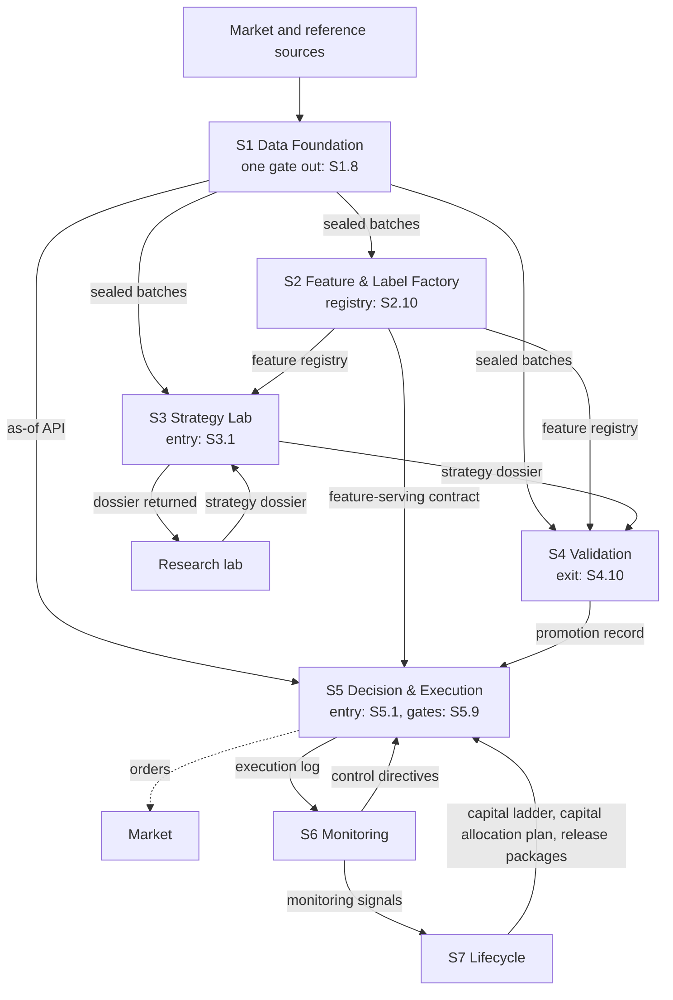
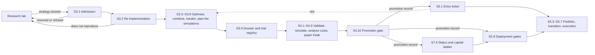
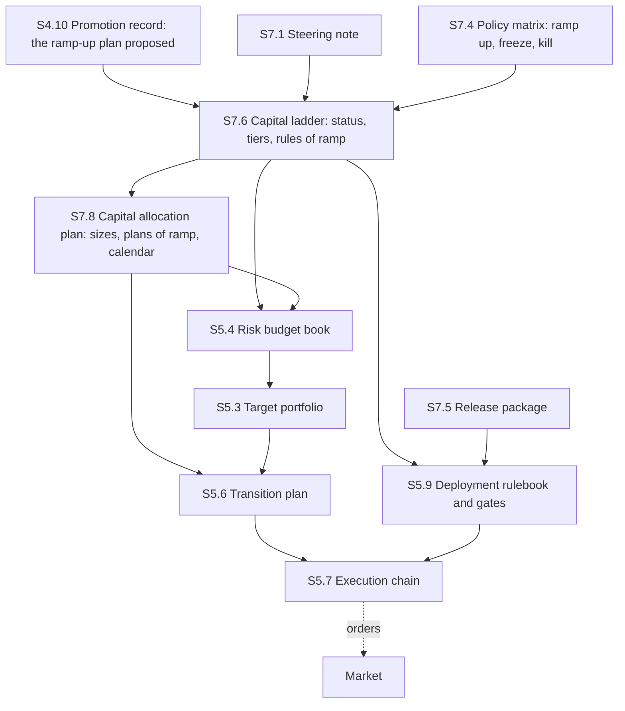
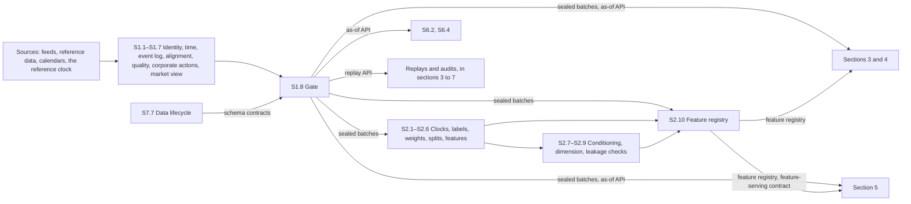
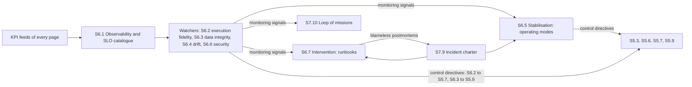
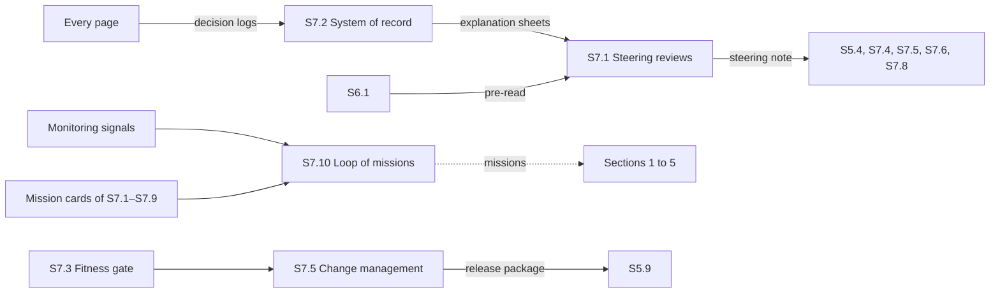

[Up: Factory](README.md)

# Architecture

## TL;DR

The factory once built: its components, its stores and the flows between the seven sections, drawn as one overview and five views.
A strategy enters from the research lab at S3.1, is judged at S4.10, and reaches capital through S5.1 and S5.9.
Capital decisions leave lifecycle as the capital ladder (S7.6) and the capital allocation plan (S7.8), which section 5 applies.

## The whole factory

Solid arrows are artefacts declared in the Interfaces tables; dashed arrows are the flows the pages
carry in their text, such as the orders that
[S5.7](sections/s5-decision-execution/s5.7-execution-chain.md) routes to the market. Not drawn:
every page also sends its [KPI feed](glossary.md#kpi-feed) to monitoring
([S6.1](sections/s6-monitoring/s6.1-shared-observability.md)) and its
[decision log](glossary.md#decision-log) to the system of record
([S7.2](sections/s7-lifecycle/s7.2-decision-record.md)), and section 7's missions go back to
sections 1 to 5 (see [Governance and learning](#governance-and-learning)). The
[interfaces](interfaces.md) list every flow; each section page draws its own sub-sections.

## Components and stores

| Component | Kind | Kept by | What it holds or does |
|---|---|---|---|
| [Event log](glossary.md#event-log) and [bitemporal store](glossary.md#bitemporal-store) | Store | [S1.3](sections/s1-data-foundation/s1.3-timebase-replay.md), [S1.2](sections/s1-data-foundation/s1.2-bitemporality.md) | Every event, immutable and ordered, and every fact with its [valid time](glossary.md#valid-time) and [transaction time](glossary.md#transaction-time). |
| [Sealed batches](glossary.md#sealed-batch), [batch registry](glossary.md#batch-registry), [evidence locker](glossary.md#evidence-locker) | Store | [S1.8](sections/s1-data-foundation/s1.8-data-governance.md) | The only data that leaves section 1, versioned, with its manifest and its proof of no [leakage](glossary.md#leakage). |
| [As-of API](glossary.md#as-of-api) and [replay API](glossary.md#replay-api) | Service | S1.8 | The only ways to read data as of an instant, and to [replay](glossary.md#replay) any past interval to the byte. |
| [Anti-leakage gate](glossary.md#anti-leakage-gate) | [Gate](glossary.md#gate) | S1.8 | Seals what leaves section 1; a batch that fails it is not published. |
| [Feature registry](glossary.md#feature-registry) and [feature-serving contract](glossary.md#feature-serving-contract) | Store, service | [S2.10](sections/s2-feature-label-factory/s2.10-feature-registry.md) | Every [feature](glossary.md#feature), [label](glossary.md#label) and weight with its [lineage](glossary.md#lineage), and how production is served the same computation as research. |
| [Strategy dossier](glossary.md#strategy-dossier) and [trial registry](glossary.md#trial-registry) | Store | [S3.9](sections/s3-strategy-lab/s3.9-traceability-rationale.md); [S4.2](sections/s4-validation/s4.2-validity-inference.md) | The strategy as it travels, and every trial run on it, in the lab, section 3 and section 4. |
| [Execution simulator](glossary.md#execution-simulator) | Service | [S4.6](sections/s4-validation/s4.6-execution-simulator.md) | Prices each style of execution before trading, calibrated on cost analysis ([S4.7](sections/s4-validation/s4.7-transaction-cost-analysis.md)) and on live fills. |
| [Promotion gate](glossary.md#promotion-gate) | Gate | [S4.10](sections/s4-validation/s4.10-promotion-gates.md) | Go, go under conditions or no-go; its signed [promotion record](glossary.md#promotion-record) is section 4's single exit. |
| [Entry ticket](glossary.md#entry-ticket) | Gate | [S5.1](sections/s5-decision-execution/s5.1-onboarding-eligibility.md) | Green, orange (a dated pilot) or red for each strategy entering the portfolio. |
| [Risk budget book](glossary.md#risk-budget-book) | Store | [S5.4](sections/s5-decision-execution/s5.4-allocation-budgets.md) | Every limit, ranked hard or soft, as the constraints that portfolio, transition and execution apply. |
| Optimiser and [target portfolio](glossary.md#target-portfolio) | Service | [S5.3](sections/s5-decision-execution/s5.3-portfolio-construction.md) | The weights, feasible within the budgets, at every cycle. |
| [Transition plan](glossary.md#transition-plan) | Service | [S5.6](sections/s5-decision-execution/s5.6-transition-planner.md) | The dated quantities and tempo that move the portfolio to its target. |
| [Execution chain](glossary.md#execution-chain) and [execution log](glossary.md#execution-log) | Service, store | S5.7 | Orders to the market, with [pre-trade checks](glossary.md#pre-trade-check), and every parent order, child order and fill. |
| [Cost surface](glossary.md#cost-surface) | Store | [S5.8](sections/s5-decision-execution/s5.8-execution-analytics.md) | Costs and [capacity](glossary.md#capacity) by context, recalibrated on fills. |
| [Deployment rulebook](glossary.md#deployment-rulebook) and [kill switch](glossary.md#kill-switch) | Gate, control | [S5.9](sections/s5-decision-execution/s5.9-governance-safety.md) | The perimeter, the limits, the stages from paper to full, and the real-time controls. |
| [SLO catalogue](glossary.md#slo-catalogue) | Store | S6.1 | The one definition of every [SLI](glossary.md#sli), [SLO](glossary.md#slo) and [error budget](glossary.md#error-budget). |
| [Operating modes](glossary.md#operating-mode) and [control directives](glossary.md#control-directive) | Control | [S6.5](sections/s6-monitoring/s6.5-controlled-degradation.md); [S6.2](sections/s6-monitoring/s6.2-execution-fidelity.md), [S6.3](sections/s6-monitoring/s6.3-data-integrity-compliance.md) | The ladder from normal to a global stop, and the orders section 5 obeys at once. |
| [Runbooks](glossary.md#runbook) | Store | [S6.7](sections/s6-monitoring/s6.7-intervention-learning.md) | Every procedure of the factory, tested in [drills](glossary.md#drill). |
| [Monitoring as code](glossary.md#monitoring-as-code) | Platform | [S6.8](sections/s6-monitoring/s6.8-monitoring-as-code.md) | The versioned rules, pipelines and quotas that carry monitoring's flows. |
| System of record | Store | S7.2 | Every decision log, with a readable reason for every trade. |
| [Policy matrix](glossary.md#policy-matrix) | Control | [S7.4](sections/s7-lifecycle/s7.4-reliability-risk-budgets.md) | The state of the budgets of reliability and risk turned into ramp up, freeze or kill. |
| [Release package](glossary.md#release-package) | Store | [S7.5](sections/s7-lifecycle/s7.5-change-management.md) | Every change as one immutable, rehearsed, reversible package. |
| [Capital ladder](glossary.md#capital-ladder) | Control | [S7.6](sections/s7-lifecycle/s7.6-champion-challenger.md) | The status of each strategy and the rules by which its capital rises and falls. |
| [Capital allocation plan](glossary.md#capital-allocation-plan) | Control | [S7.8](sections/s7-lifecycle/s7.8-capital-cost-steering.md) | Sizes, caps, plans of ramp and the calendar of [rebalancing](glossary.md#rebalancing), weekly or fortnightly. |
| [Incident charter](glossary.md#incident-charter) | Control | [S7.9](sections/s7-lifecycle/s7.9-incident-response.md) | Roles, severities and the path of every incident. |

## From the lab to capital

[S3.1](sections/s3-strategy-lab/s3.1-admission.md) returns a dossier to the lab when a part is
missing, when its thesis cannot be stated in falsifiable form, or when its data cannot be had point
in time, and rejects it when it falls outside the factory's non-negotiable constraints;
[S3.2](sections/s3-strategy-lab/s3.2-architecture-invariances.md) returns it when its result does
not reproduce on the factory's data. Section 3 improves the strategy and section 4 judges it: a
no-go at S4.10 stops it there, with its reasons in the promotion record. A red entry ticket sends
the reasons back to section 3.

## Capital handed to execution

The ramp-up plan is one plan in several hands: section 4 proposes it; the capital ladder sets the
tiers and the rules; capital steering schedules the moves within them, every week or fortnight; the
risk budget book turns them into budgets; and the governance of section 5 (S5.9) gates each step, as
it rolls out every release package. The [steering note](glossary.md#steering-note) also reaches
S5.4, S7.4, S7.5 and S7.8, and the policy matrix S5.4, S5.9, S7.5 and S7.8.

## Data, for research and for live

No data reaches sections 2 to 5 except through S1.8. Research reads pinned sealed batches; live
execution reads the market (levels 1 and 2 of the books, halts) through the as-of API, as
monitoring's [execution fidelity](glossary.md#execution-fidelity) and [drift](glossary.md#drift)
detection do; audits and replays go through the replay API. The
[data lifecycle](glossary.md#data-lifecycle) ([S7.7](sections/s7-lifecycle/s7.7-data-lifecycle.md))
owns the [schema contracts](glossary.md#schema-contract), which S1.8 enforces: a batch that breaks
one unannounced is not published.

## Control in production

Monitoring watches against one catalogue, and acts on section 5 only through control directives,
each within its scope: stabilisation sets the operating modes, execution fidelity steers the
execution chain, and data integrity can stop trading when integrity breaks.
[Intervention](glossary.md#intervention) runs the live response under the incident charter; the
platform (S6.8) carries all of monitoring's flows as code.

| Safety mechanism | Where it lives | What triggers it |
|---|---|---|
| Throttles, [circuit breakers](glossary.md#circuit-breaker) and the global kill switch | [S5.9](sections/s5-decision-execution/s5.9-governance-safety.md), step D | Thresholds in the deployment rulebook; the kill switch also executes the capital ladder's freezes, ramp-downs and kills. |
| [Rollback](glossary.md#rollback) of a deployment | [S5.9](sections/s5-decision-execution/s5.9-governance-safety.md), step C | Rollback is the default when a key metric leaves its bounds; its runbooks neutralise positions, cancel orders and clear states. |
| Rollback of a release | [S7.5](sections/s7-lifecycle/s7.5-change-management.md) | Every release package is reversible, and its rollout plan carries the map of the kill switch: what to cut, and in which order. |
| Ramp up, freeze, kill | [S7.4](sections/s7-lifecycle/s7.4-reliability-risk-budgets.md) | The policy matrix of the budgets of reliability and risk; two pairs of eyes on the kill switch and the rollback. |
| Operating modes, down to a global stop | [S6.5](sections/s6-monitoring/s6.5-controlled-degradation.md) | [Monitoring signals](glossary.md#monitoring-signal); S5.9's kill switch executes the last rungs. |
| Stop when integrity breaks | [S6.3](sections/s6-monitoring/s6.3-data-integrity-compliance.md) | A failed reconciliation or broken integrity, through a control directive to S5.9. |

## Governance and learning

Every decision is written into one system of record; steering starts from a
[pre-read](glossary.md#pre-read) and ends with a written note. Signals and lifecycle's findings
become missions in one queue, which [S7.10](sections/s7-lifecycle/s7.10-monitoring-feedback-loop.md)
routes to the section that does the work; a mission that changes production travels as a release
package, through the [fitness gate](glossary.md#fitness-gate) and S5.9.
