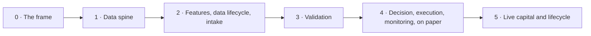

[Up: Factory](README.md)

# Build sequence

## TL;DR

How the factory would be built from zero: a frame, then five phases that each end on a gate, from the data spine to live capital.
The build starts with the frame (phase 0), then section 1's identity, time and replay (S1.1 to S1.4).
Effort is sized by the design and execution steps of the 64 pages: 401 steps, nearly two in three of them design.

## The phases

| Phase | What it builds | Sub-sections, in order | Steps | Design | Execution | Both | Share |
|---|---|---|---|---|---|---|---|
| 0 | The frame: intent, decision rights, the first journal, incidents, rituals | First versions of [S7.1](sections/s7-lifecycle/s7.1-steering-cadences.md), [S7.2](sections/s7-lifecycle/s7.2-decision-record.md) and [S7.9](sections/s7-lifecycle/s7.9-incident-response.md), completed in phase 5 | — | — | — | — | — |
| 1 | The data spine: a [point-in-time](glossary.md#point-in-time) record of the market that [replays](glossary.md#replay) bit for bit | [S1.1](sections/s1-data-foundation/s1.1-identity-reference-universe.md), [S1.2](sections/s1-data-foundation/s1.2-bitemporality.md), [S1.3](sections/s1-data-foundation/s1.3-timebase-replay.md), [S1.4](sections/s1-data-foundation/s1.4-causality-synchronization.md), [S1.8](sections/s1-data-foundation/s1.8-data-governance.md), [S1.7](sections/s1-data-foundation/s1.7-canonical-market-views.md), [S1.6](sections/s1-data-foundation/s1.6-corporate-actions.md), [S1.5](sections/s1-data-foundation/s1.5-data-quality.md) | 53 | 41 | 10 | 2 | 13% |
| 2 | [Features](glossary.md#feature) and [labels](glossary.md#label), the [data lifecycle](glossary.md#data-lifecycle), and the intake of the lab's strategies | [S2.1](sections/s2-feature-label-factory/s2.1-event-clocks-sampling.md), [S2.2](sections/s2-feature-label-factory/s2.2-labeling.md), [S2.4](sections/s2-feature-label-factory/s2.4-temporal-integrity.md), [S2.3](sections/s2-feature-label-factory/s2.3-sample-weights.md), [S2.9](sections/s2-feature-label-factory/s2.9-leakage-checks.md), [S2.5](sections/s2-feature-label-factory/s2.5-stationarity-memory.md), [S2.6](sections/s2-feature-label-factory/s2.6-robust-features.md), [S2.7](sections/s2-feature-label-factory/s2.7-numerical-conditioning.md), [S2.10](sections/s2-feature-label-factory/s2.10-feature-registry.md), [S2.8](sections/s2-feature-label-factory/s2.8-information-dimension.md), [S7.7](sections/s7-lifecycle/s7.7-data-lifecycle.md), [S3.1](sections/s3-strategy-lab/s3.1-admission.md), [S3.2](sections/s3-strategy-lab/s3.2-architecture-invariances.md), [S3.3](sections/s3-strategy-lab/s3.3-disciplined-optimization.md), [S3.4](sections/s3-strategy-lab/s3.4-alpha-combination.md), [S3.7](sections/s3-strategy-lab/s3.7-robustness-by-construction.md), [S3.9](sections/s3-strategy-lab/s3.9-traceability-rationale.md), [S3.5](sections/s3-strategy-lab/s3.5-large-scale-inference.md), [S3.6](sections/s3-strategy-lab/s3.6-variant-exploration.md), [S3.8](sections/s3-strategy-lab/s3.8-simulation-plans.md) | 129 | 82 | 37 | 10 | 32% |
| 3 | Validation, the [execution simulator](glossary.md#execution-simulator), cost analysis and [paper trading](glossary.md#paper-trading) | [S4.1](sections/s4-validation/s4.1-experimental-protocol.md), [S4.2](sections/s4-validation/s4.2-validity-inference.md), [S4.3](sections/s4-validation/s4.3-selection-bias.md), [S4.4](sections/s4-validation/s4.4-robustness-sensitivity.md), [S4.5](sections/s4-validation/s4.5-economic-viability.md), [S4.6](sections/s4-validation/s4.6-execution-simulator.md), [S4.7](sections/s4-validation/s4.7-transaction-cost-analysis.md), [S4.8](sections/s4-validation/s4.8-paper-trading.md), [S4.9](sections/s4-validation/s4.9-scientific-governance.md), [S4.10](sections/s4-validation/s4.10-promotion-gates.md) | 61 | 39 | 13 | 9 | 15% |
| 4 | Decision and execution, core monitoring, security and modes, budgets and releases, all on paper | [S5.9](sections/s5-decision-execution/s5.9-governance-safety.md), [S5.1](sections/s5-decision-execution/s5.1-onboarding-eligibility.md), [S5.4](sections/s5-decision-execution/s5.4-allocation-budgets.md), [S5.3](sections/s5-decision-execution/s5.3-portfolio-construction.md), [S5.6](sections/s5-decision-execution/s5.6-transition-planner.md), [S5.7](sections/s5-decision-execution/s5.7-execution-chain.md), [S5.8](sections/s5-decision-execution/s5.8-execution-analytics.md), [S5.2](sections/s5-decision-execution/s5.2-interaction-mapping.md), [S5.5](sections/s5-decision-execution/s5.5-regime-adaptation.md), [S6.1](sections/s6-monitoring/s6.1-shared-observability.md), [S6.3](sections/s6-monitoring/s6.3-data-integrity-compliance.md), [S6.2](sections/s6-monitoring/s6.2-execution-fidelity.md), [S6.4](sections/s6-monitoring/s6.4-drift-detection.md), [S6.6](sections/s6-monitoring/s6.6-operational-security.md), [S6.5](sections/s6-monitoring/s6.5-controlled-degradation.md), [S7.4](sections/s7-lifecycle/s7.4-reliability-risk-budgets.md), [S7.3](sections/s7-lifecycle/s7.3-architectural-fitness.md), [S7.5](sections/s7-lifecycle/s7.5-change-management.md) | 110 | 66 | 19 | 25 | 27% |
| 5 | Live capital by tiers, and the lifecycle around it | [S7.6](sections/s7-lifecycle/s7.6-champion-challenger.md), [S7.8](sections/s7-lifecycle/s7.8-capital-cost-steering.md), S7.2, S7.1, S7.9, [S6.7](sections/s6-monitoring/s6.7-intervention-learning.md), [S6.8](sections/s6-monitoring/s6.8-monitoring-as-code.md), [S7.10](sections/s7-lifecycle/s7.10-monitoring-feedback-loop.md) | 48 | 26 | 12 | 10 | 12% |

Steps are those of each page's Steps section, by their tag; a page counts once, in the phase that
completes it. The share is of all 401 steps. Phases 2 and 4 carry three fifths of the effort, and
design outweighs execution in every phase.

## Gates

| Phase | Enter when the builder passes | Leave when |
|---|---|---|
| 0 | — | The factory's intent and scope are written; the handoff contract with the lab is agreed, and the first strategies it will hand over are named with their universe, horizon and style; decision rights are written (who may run an official test, validate, deploy, cut, move capital); incidents have severities, roles and one channel; one journal of decisions and a first set of rituals exist. |
| 1 | The "Ready when" checks of [S1](knowledge-map.md#s1--data-foundation) | For the universe of the first strategies, any interval replays bit for bit, every dataset is sealed with its manifest, and the tests of [leakage](glossary.md#leakage) run at the [gate](glossary.md#gate). |
| 2 | Those of [S2](knowledge-map.md#s2--feature--label-factory), [S3](knowledge-map.md#s3--strategy-lab), and [S7](knowledge-map.md#s7--lifecycle) for S7.7 | For each admitted strategy: clean [in-sample](glossary.md#in-sample-out-of-sample) and out-of-sample data from sections 1 and 2, its features and labels traced in the registry, its complete dossier, and its [simulation plan](glossary.md#simulation-plan) agreed with section 4. |
| 3 | Those of [S4](knowledge-map.md#s4--validation-execution-simulation-cost-analysis-paper-trading) | Each strategy has its certification: validity, selection, [robustness](glossary.md#robustness), economic viability and [capacity](glossary.md#capacity), simulated execution, cost analysis and paper trading, and the signed decision of the [promotion gate](glossary.md#promotion-gate); the others are refused or quarantined, with their reasons written. |
| 4 | Those of [S5](knowledge-map.md#s5--decision--execution) and [S6](knowledge-map.md#s6--monitoring); those of S7, passed in phase 2, cover S7.3 to S7.5 | The approved strategies run in full paper trading; the chain is tested end to end, from data to signal to paper order to the simulator and cost analysis; monitoring, the [operating modes](glossary.md#operating-mode) and the paths to the [kill switch](glossary.md#kill-switch) are tested on paper. |
| 5 | None left: every section's were passed by phase 4 | At least one strategy trades at a medium or full [capital tier](glossary.md#capital-tier); the whole chain is in place; any decision can be traced, replayed, explained, and cut cleanly. |

## Read before its owner is built

Thirteen reads reach a page built in a later phase. Each is bridged until its owner exists:

| Reader, phase | Reads | Owner, phase | Until the owner is built |
|---|---|---|---|
| S1.8, 1 | [Schema contracts](glossary.md#schema-contract) | S7.7, 2 | S1.8 seals batches on their manifests and its tests alone. |
| S3.4, 2 | The [interaction map](glossary.md#interaction-map) | S5.2, 4 | No strategy runs yet, so there is no portfolio to measure a new one against. |
| S4.7, 3 | The [execution log](glossary.md#execution-log) | S5.7, 4 | Cost analysis calibrates on paper trading (S4.8) until live fills arrive. |
| S5.4, S5.6, S5.9, S6.1; 4 | The [capital ladder](glossary.md#capital-ladder), the [capital allocation plan](glossary.md#capital-allocation-plan), the [trigger-action catalogue](glossary.md#trigger-action-catalogue) | S7.6, S7.8; 5 | Phase 4 trades on paper: no capital is decided before phase 5. The [promotion record](glossary.md#promotion-record)'s triggers and actions reach S6.1 meanwhile. |
| S5.4, S7.4, S7.5; 4 | The [steering note](glossary.md#steering-note) | S7.1, 5 | The first version of S7.1, from phase 0. |
| S6.3, 4 | The [explanation sheet](glossary.md#explanation-sheet) | S7.2, 5 | The first version of S7.2, from phase 0. |
| S6.5, 4 | The [incident charter](glossary.md#incident-charter) | S7.9, 5 | The first version of S7.9, from phase 0: severities, roles, one channel. |

Inside a phase, a page may also read one placed after it, as S1.8 reads the three pages it seals:
every page of a phase is finished before its gate. The [interfaces](interfaces.md) list every flow.

## Why this order

- **Each phase gives the next what it needs**: a frame, then the data spine, features and the
  strategies, validation, decision and execution on paper, then live capital with its lifecycle,
  each phase ending on a gate. Inside a phase, the list gives a workable order, not a binding one.
  The phases build the whole factory, not a smaller first version of it.
- **Four lifecycle pages are placed by what they depend on**: the data lifecycle (S7.7) after the
  [feature registry](glossary.md#feature-registry), in phase 2; architectural fitness (S7.3) and the
  budgets of reliability and risk (S7.4) in phase 4, before
  [change management](glossary.md#change-management) (S7.5) and before any capital; the loop of
  missions (S7.10) last, since it gathers from every page of section 7.
- **[Drift](glossary.md#drift), security and the operating modes come before any capital**: drift
  detection (S6.4), operational security (S6.6) and stabilisation with its operating modes (S6.5)
  are built in phase 4, where section 5 and monitoring already read them, each after the pages it
  reads.
- **Lifecycle starts in phase 0 and ends in phase 5**: phase 0 builds a first version of the
  rituals, the journal of decisions and the handling of incidents, and phase 5 completes them once
  capital is live.
- **From phase 3, one strategy leads the build**: the first the lab hands over is carried through
  validation, paper trading and its first capital tier; the others follow on the finished chain.
- **Effort is counted in steps**, by the tags every page carries: a
  [design task](glossary.md#design-task) needs judgment (choosing, specifying), an
  [execution task](glossary.md#execution-task) work to a known specification (building, running),
  and a step tagged with both needs both. Steps differ in size, so the count ranks the phases, it
  does not date them.
