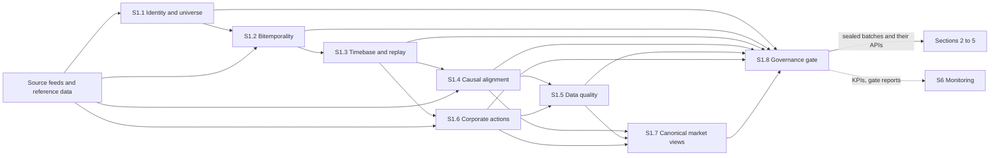

[Up: all sections](../README.md) · [S2 Feature & Label Factory →](../s2-feature-label-factory/README.md)

# S1 — Data Foundation

## TL;DR

Point-in-time market and reference data: who each instrument is, what was known when, and an exact replay of any past day.
Eight sub-sections take raw feeds to sealed, versioned batches through identity, two clocks, one ordered log, causal joins, quality control and corporate actions.
No data reaches sections 2 to 5 except through the anti-leakage gate of S1.8.

## Purpose

Section 1 gives the factory data it can trust in time. Every fact carries when it was true and
when it was known ([bitemporality](../../glossary.md#bitemporality)); every read names the date
it is made [as of](../../glossary.md#as-of-api); every dataset can be [replayed](../../glossary.md#replay)
bit for bit; and nothing reaches [features](../../glossary.md#feature), strategies, validation or execution without passing
the [anti-leakage gate](../../glossary.md#anti-leakage-gate) of S1.8.

The test of success is S1.8's: six months later, a [backtest](../../glossary.md#backtest) rerun on the same
[sealed batch](../../glossary.md#sealed-batch) gives the same results, bit for bit.

## How the section fits together

Identity (S1.1), the two clocks (S1.2) and the ordered log (S1.3) are the base every other
sub-section reads. [Causal alignment](../../glossary.md#causal-alignment) (S1.4), quality control (S1.5) and [corporate actions](../../glossary.md#corporate-action) (S1.6)
turn raw feeds into trustworthy series; canonical views (S1.7) give the whole factory one grammar
of the market; the [gate](../../glossary.md#gate) (S1.8) seals what leaves. Only the main flows are drawn; each page's Interfaces table
lists them all.

## Sub-sections

| ID | Sub-section | Purpose |
|---|---|---|
| S1.1 | [Identity, reference data & point-in-time universe](s1.1-identity-reference-universe.md) | Who each instrument is, where it trades and whether it could be traded, on any past day. |
| S1.2 | [Temporal semantics & bitemporality](s1.2-bitemporality.md) | Two clocks on every fact, and reads made only as of a stated date. |
| S1.3 | [Deterministic timebase, immutability & replay](s1.3-timebase-replay.md) | One immutable, ordered [event log](../../glossary.md#event-log) that replays bit for bit. |
| S1.4 | [Causality & multi-source synchronisation](s1.4-causality-synchronization.md) | Multi-source panels in which no value is used before it was published. |
| S1.5 | [Data quality: rules, ML and human in the loop](s1.5-data-quality.md) | Rules, detectors and people certify every dataset before it is used. |
| S1.6 | [Corporate actions, adjustments & traceability](s1.6-corporate-actions.md) | Splits, dividends and mergers adjusted without leaking the future. |
| S1.7 | [Canonical market views & microstructure primitives](s1.7-canonical-market-views.md) | One standard set of [bars](../../glossary.md#bar) and microstructure measures for the whole factory. |
| S1.8 | [Governance: provenance, versioning & anti-leakage gates](s1.8-data-governance.md) | The single gate: sealed, versioned batches with proof of no [leakage](../../glossary.md#leakage). |

## Before building it

What to master before building this section, and the checks that say when a builder is ready:
[its part of the knowledge map](../../knowledge-map.md#s1--data-foundation).
