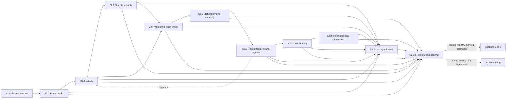

[← S1 Data Foundation](../s1-data-foundation/README.md) · [Up: all sections](../README.md) · [S3 Strategy Lab →](../s3-strategy-lab/README.md)

# S2 — Feature & Label Factory

## TL;DR

Turns sealed data into features and labels a model can learn from, sampled, weighted and split so that the future never leaks into the past.
Ten sub-sections: event clocks, labels, weights, validation splits, stationarity, robust features and regimes, conditioning, selection, a leakage firewall, a registry.
No feature, label or weight reaches sections 3 to 5 except through the registry of S2.10, after the firewall of S2.9.

## Purpose

Section 2 turns the [sealed batches](../../glossary.md#sealed-batch) of section 1 into the
material models learn from: when to observe ([event clocks](../../glossary.md#event-clock)), what
happened next ([labels](../../glossary.md#label)), how much each observation counts
([sample weights](../../glossary.md#sample-weight)), how to split time for validation without
[leakage](../../glossary.md#leakage), and [features](../../glossary.md#feature) that are stationary, robust, well conditioned
and informative. Every artefact is [point-in-time](../../glossary.md#point-in-time), versioned, and
computed identically in research and in serving ([train/serve parity](../../glossary.md#train-serve-parity)).

The test of success is S2.9's: a representation is delivered only if it can be computed at *t0*,
with no leak from the future and no statistical illusion, and S2.10 can [replay](../../glossary.md#replay) it exactly.

## How the section fits together

Event clocks (S2.1) decide when to observe. Labels (S2.2), weights (S2.3) and the
[validation-ready index](../../glossary.md#validation-ready-index) (S2.4) say what happened after each event, how much each event counts, and how time is split
without leakage. [Stationarity](../../glossary.md#stationarity) (S2.5), robust features and [regimes](../../glossary.md#regime) (S2.6), conditioning (S2.7) and
information management (S2.8) build a short, stable, well-scaled set of features. The firewall
(S2.9) checks that everything can be computed at *t0*, and the registry (S2.10) records, versions
and serves it. Only the main flows are drawn; each page's Interfaces table lists them all.

## Sub-sections

| ID | Sub-section | Purpose |
|---|---|---|
| S2.1 | [Event clocks & sampling design](s2.1-event-clocks-sampling.md) | When to observe: a causal [event index](../../glossary.md#event-index) per asset and regime, in place of the wall clock. |
| S2.2 | [Labelling schemes (side, size, meta)](s2.2-labeling.md) | What followed each event: its side, its size and a meta label, all point-in-time. |
| S2.3 | [Overlap-aware sample weights & resampling](s2.3-sample-weights.md) | Weights that count overlapping events once, and resampling without leakage. |
| S2.4 | [Temporal integrity & validation-ready indexing](s2.4-temporal-integrity.md) | Purged, embargoed, versioned splits: validation with zero leakage. |
| S2.5 | [Stationarity & memory preservation](s2.5-stationarity-memory.md) | Stationary series that keep the [memory](../../glossary.md#memory) carrying the edge. |
| S2.6 | [Robust feature construction, microstructure & regime encoding](s2.6-robust-features.md) | Robust multi-horizon features, [quality flags](../../glossary.md#quality-flag) and dated market regimes. |
| S2.7 | [Numerical conditioning & orthogonalisation](s2.7-numerical-conditioning.md) | Well-scaled, weakly redundant features, identical in research and serving. |
| S2.8 | [Information & dimension management](s2.8-information-dimension.md) | A short, stable, cheap core of features, chosen out of sample. |
| S2.9 | [Representation sanity & leakage checks](s2.9-leakage-checks.md) | The firewall: nothing leaves section 2 unless it is usable at t0. |
| S2.10 | [Registry, lineage & feature-serving contracts](s2.10-feature-registry.md) | The registry: what each feature is, how it was made and how it is served. |

## Before building it

What to master before building this section, and the checks that say when a builder is ready:
[its part of the knowledge map](../../knowledge-map.md#s2--feature--label-factory).
