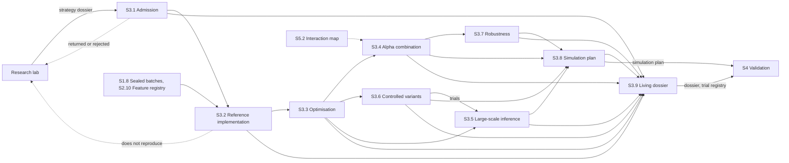

[← S2 Feature & Label Factory](../s2-feature-label-factory/README.md) · [Up: all sections](../README.md) · [S4 Validation →](../s4-validation/README.md)

# S3 — Strategy Lab

## TL;DR

Admits the research lab's strategy dossier, rebuilds it on factory data and improves it: from a 60–70% product to an 80–90% one.
Nine sub-sections: admission, re-implementation, optimisation, combination, inference, variants, robustness, simulation plans, the living dossier.
S3 improves, S4 judges: every trial run here joins the dossier's trial registry, and the factory never searches for alpha.

## Purpose

Section 3 takes in what the research lab found and makes it a factory product. A
[strategy dossier](../../glossary.md#strategy-dossier) arrives from the lab under the
[handoff contract](../../../handoff/README.md); S3.1 admits it, returns it to the lab, or rejects
it. An admitted strategy is rebuilt on the factory's own [point-in-time](../../glossary.md#point-in-time) data, and the lab's result
must reproduce there (S3.2). It is then calibrated under a declared
[trial budget](../../glossary.md#trial-budget) (S3.3), combined with its own [alphas](../../glossary.md#alpha) and measured
against the strategies already running (S3.4), tested for what survives many trials (S3.5),
explored through controlled [variants](../../glossary.md#variant) (S3.6), and made robust by
construction (S3.7). S3.8 freezes the [simulation plan](../../glossary.md#simulation-plan) section
4 will run, and S3.9 keeps the dossier alive, the same dossier the lab started.

**S3 improves, S4 judges.** Improving means trying more, which raises the risk of
[overfitting](../../glossary.md#overfitting). Every trial run in section 3 is appended to the
dossier's [trial registry](../../glossary.md#trial-registry), which the lab started, and section 4
corrects its statistics for the total number of trials. Section 3 never validates its own
improvements, and it never searches for new ideas: that is the lab's work.

## How the section fits together

[Admission](../../glossary.md#admission) (S3.1) is the front door: the dossier is checked against the handoff contract and its
thesis restated in factory terms. The re-implementation (S3.2) is the first test: a result that
does not reproduce on factory data sends the dossier back to the lab. Optimisation (S3.3),
combination (S3.4), inference (S3.5), variants (S3.6) and [robustness](../../glossary.md#robustness) (S3.7) improve the strategy,
each adding its trials to the registry. S3.8 turns the improved strategy into the plan section 4
will run, and S3.9 gathers everything into the dossier that sections 4 to 7 work from. Only the
main flows are drawn; each page's Interfaces table lists them all.

## Sub-sections

| ID | Sub-section | Purpose |
|---|---|---|
| S3.1 | [Admission: dossier intake & decision frame](s3.1-admission.md) | The front door: the lab's dossier checked, its thesis restated, then admitted, returned or rejected. |
| S3.2 | [Architecture & invariances: re-implementation on factory data](s3.2-architecture-invariances.md) | The strategy rebuilt on factory data, in a standard architecture; the lab's result must reproduce. |
| S3.3 | [Disciplined optimisation programme](s3.3-disciplined-optimization.md) | Fine [calibration](../../glossary.md#calibration) under a declared trial budget: a useful objective, few constraints, a stable solution. |
| S3.4 | [Alpha combination & internal allocation](s3.4-alpha-combination.md) | Many alphas into one position per asset, and the strategy measured against those already running. |
| S3.5 | [Large-scale inference (calibration, shrinkage, tests, multiplicity)](s3.5-large-scale-inference.md) | Hundreds of variants into a few credible candidates, the lab's trials counted. |
| S3.6 | [Controlled variant exploration & experiment design](s3.6-variant-exploration.md) | Controlled variants around the admitted strategy, never idea search: which hold, which break. |
| S3.7 | [Robustness by construction](s3.7-robustness-by-construction.md) | Shock absorbers built into the strategy: close to the plain version in calm markets, safer in dirty ones. |
| S3.8 | [Simulation plans & pass criteria (towards section 4)](s3.8-simulation-plans.md) | The test bench and the frozen green, orange or red contract that section 4 will run. |
| S3.9 | [Traceability & design rationale: the living strategy dossier](s3.9-traceability-rationale.md) | The living strategy dossier: idea, choices, trials, evidence and decision, replayable by anyone. |

## Before building it

What to master before building this section, and the checks that say when a builder is ready:
[its part of the knowledge map](../../knowledge-map.md#s3--strategy-lab).
