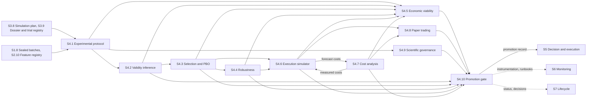

[← S3 Strategy Lab](../s3-strategy-lab/README.md) · [Up: all sections](../README.md) · [S5 Decision & Execution →](../s5-decision-execution/README.md)

# S4 — Validation, execution simulation, cost analysis, paper trading

## TL;DR

The factory's counter-expertise: it never takes the dossier's results at face value, and judges every strategy that section 3 improved.
Ten sub-sections: protocol, validity, selection, robustness, economics, execution simulator, cost analysis, paper trading, governance, promotion gate.
No strategy reaches section 5 without the signed promotion record of S4.10: go, go under conditions, or no-go.

## Purpose

Section 4 judges. It receives the [strategy dossier](../../glossary.md#strategy-dossier) that
section 3 improved, with its [trial registry](../../glossary.md#trial-registry) and its
[simulation plan](../../glossary.md#simulation-plan), and never takes their results at face value:
S3 improves, S4 judges. S4.1 sets honest tests against the future. S4.2 and S4.3 correct every
statistic for the total number of trials, the lab's and section 3's included. S4.4 shakes the
strategy, and S4.5 checks that its edge survives costs at size. The
[execution simulator](../../glossary.md#execution-simulator) (S4.6) and
[transaction cost analysis](../../glossary.md#transaction-cost-analysis) (S4.7) form a closed loop
between forecast and measured costs. S4.8 runs the factory's campaign of
[paper trading](../../glossary.md#paper-trading), distinct from the lab's short paper run. S4.9
makes every result pre-registered and replayable, and S4.10 decides at the
[promotion gate](../../glossary.md#promotion-gate).

The test of success: a strategy reaches section 5 only with a signed
[promotion record](../../glossary.md#promotion-record), statistically valid once every trial is
counted, robust, viable at size, executable as simulated, and stable through weeks of paper
trading.

## How the section fits together

The [experimental protocol](../../glossary.md#experimental-protocol) (S4.1) cuts time into purged, embargoed partitions and counts every
trial. Validity inference (S4.2) gives each candidate a probabilistic verdict, deflated for the
whole trial registry, and selection (S4.3) measures how likely the [in-sample](../../glossary.md#in-sample-out-of-sample) winner is to fail out
of sample. [Robustness](../../glossary.md#robustness) (S4.4) and economic viability (S4.5) say what breaks the strategy and what it
can earn at size. The execution simulator (S4.6) and cost analysis (S4.7) recalibrate each other;
paper trading (S4.8) connects the whole chain to the market with no capital at risk. Scientific
governance (S4.9) sets the rules every page follows: no test without [pre-registration](../../glossary.md#pre-registration), every
result replayable. The promotion gate (S4.10) gathers the evidence, scores five pillars and signs
the promotion record, the section's single exit. Only the main flows are drawn; each page's
Interfaces table lists them all.

## Sub-sections

| ID | Sub-section | Purpose |
|---|---|---|
| S4.1 | [Experimental protocol & anti-leakage barriers](s4.1-experimental-protocol.md) | Honest tests against the future: purged and embargoed partitions, every trial run and counted. |
| S4.2 | [Validity inference & control of statistical illusions](s4.2-validity-inference.md) | A probabilistic verdict on each edge: real, repeatable and useful after costs, deflated for every trial. |
| S4.3 | [Hierarchical selection & selection-bias risk (PBO)](s4.3-selection-bias.md) | A tournament that measures how likely the in-sample winner is to fail out of sample. |
| S4.4 | [Multi-axis robustness & sensitivity (statistical and engineering)](s4.4-robustness-sensitivity.md) | What breaks the strategy when data, costs, [liquidity](../../glossary.md#liquidity), latency or [regimes](../../glossary.md#regime) are shaken. |
| S4.5 | [Economic viability, capacity & the fundamental law](s4.5-economic-viability.md) | Net P&L at size: costs, [turnover](../../glossary.md#turnover), [capacity](../../glossary.md#capacity), and the share of the edge that survives execution. |
| S4.6 | [Execution simulator (XSIM): microstructure, calibration, verification & validation](s4.6-execution-simulator.md) | The execution twin: costs, fills and delays at size and by regime, calibrated and validated. |
| S4.7 | [Universal transaction cost analysis & execution attribution (closed loop)](s4.7-transaction-cost-analysis.md) | The meter of ground truth: every basis point from decision to fill, measured and explained. |
| S4.8 | [Orchestrated paper trading & operational guardrails](s4.8-paper-trading.md) | The factory's paper-trading campaign: the whole chain live on the market, with no capital at risk. |
| S4.9 | [Scientific governance, traceability & reproducibility](s4.9-scientific-governance.md) | Every result pre-registered, traced, and replayable by any peer within a known tolerance. |
| S4.10 | [Promotion gates, risk tolerances & fallback mechanisms](s4.10-promotion-gates.md) | The promotion gate: go, go under conditions or no-go, with its limits, ramp-up and retreat. |

## Before building it

What to master before building this section, and the checks that say when a builder is ready:
[its part of the knowledge map](../../knowledge-map.md#s4--validation-execution-simulation-cost-analysis-paper-trading).
