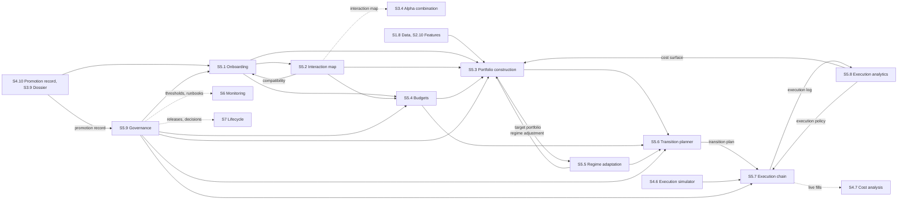

[← S4 Validation](../s4-validation/README.md) · [Up: all sections](../README.md) · [S6 Monitoring →](../s6-monitoring/README.md)

# S5 — Decision & Execution

## TL;DR

Turns promoted strategies into a live portfolio: who enters and at what size, how strategies interact, target weights within budgets, the path to them, and orders filled at controlled cost.
Nine sub-sections: onboarding, interactions, construction, budgets, regimes, transitions, execution, execution analytics, governance.
Nothing reaches the market except in small doses, bounded, reversible in minutes and explainable in five: S5.9's rulebook frames every step.

## Purpose

Section 5 decides and executes. It receives from section 4 the [promotion record](../../glossary.md#promotion-record) of each strategy,
with the [strategy dossier](../../glossary.md#strategy-dossier) of section 3, and turns them into capital that lives in the market. S5.1
decides whether the strategy enters, at what size and within which bounds: its [entry ticket](../../glossary.md#entry-ticket). S5.2
maps how it interacts with the strategies already running, and S5.4 sets, in its [risk budget book](../../glossary.md#risk-budget-book),
the budgets of risk, [liquidity](../../glossary.md#liquidity) and [capacity](../../glossary.md#capacity) that no decision crosses. S5.3 builds the
[target portfolio](../../glossary.md#target-portfolio) within those budgets, and S5.5 adapts it to the market [regime](../../glossary.md#regime) when the benefit beats the
cost. S5.6 plans the path from the current portfolio to the target, its [transition plan](../../glossary.md#transition-plan), and S5.7
executes it, order by order, leaving an immutable [execution log](../../glossary.md#execution-log). S5.8 measures what execution
really cost, and feeds the corrected costs and rules back into every decision. S5.9 governs the
whole: limits, [gates](../../glossary.md#gate), real-time controls, and the release of every change in small doses.

The test of success: at every cycle, a portfolio feasible within its budgets, reached at the cost
forecast before trading, with every trade explainable, bounded and reversible.

## How the section fits together

[Onboarding](../../glossary.md#onboarding) (S5.1) turns the promotion record into an entry ticket, and asks the [interaction map](../../glossary.md#interaction-map)
(S5.2) how the strategy sits among those already running; the map also goes back to the Strategy
Lab (S3.4). The budgets (S5.4) frame everything that follows. [Portfolio construction](../../glossary.md#portfolio-construction) (S5.3) solves
for the target weights within them; regime adaptation (S5.5) reads the result and returns the
regime's scalers for the next cycle. The transition planner (S5.6) decides what to move and how
fast, and the [execution chain](../../glossary.md#execution-chain) (S5.7) trades it, pricing each style with section 4's calibrated
[execution simulator](../../glossary.md#execution-simulator); its execution log also lets section 4's cost analysis keep calibrating on live
fills. [Execution analytics](../../glossary.md#execution-analytics) (S5.8) closes the loop: its [cost surface](../../glossary.md#cost-surface) feeds construction, budgets,
regimes and transitions, and its [execution policy](../../glossary.md#execution-policy) the chain. Governance (S5.9) sets the
[deployment rulebook](../../glossary.md#deployment-rulebook) that every step obeys, and releases every change by canary. Only the main flows are drawn;
each page's Interfaces table lists them all.

## Sub-sections

| ID | Sub-section | Purpose |
|---|---|---|
| S5.1 | [Onboarding & capital eligibility](s5.1-onboarding-eligibility.md) | Whether a promoted strategy enters the portfolio, at what size and within which bounds: its entry ticket. |
| S5.2 | [Interaction mapping & alpha diversification](s5.2-interaction-mapping.md) | Who resembles, completes, hinders or breaks with whom: the living interaction map and its rules. |
| S5.3 | [Portfolio construction engine (convex & stochastic)](s5.3-portfolio-construction.md) | Target weights that maximise net value within the budgets: feasible, robust, explained by their sensitivities. |
| S5.4 | [Allocation layer & budgets (risk, liquidity, capacity)](s5.4-allocation-budgets.md) | The workable envelope of risk, liquidity and capacity, as constraints the engine applies: the risk budget book. |
| S5.5 | [Regime adaptation (sequential control)](s5.5-regime-adaptation.md) | Exposures scaled to the market regime, only when the benefit beats the cost, never beyond the budgets. |
| S5.6 | [Transition planner (path-aware rebalancing)](s5.6-transition-planner.md) | What to move, when and how fast, from the current portfolio to the target: the dated transition plan. |
| S5.7 | [Unified execution chain (pre-trade, smart routing, OMS/EMS)](s5.7-execution-chain.md) | Target weights and a transition path turned into real fills at the least cost, safely, with every order traced. |
| S5.8 | [Execution analytics & the TCA/XSIM feedback loop into decisions](s5.8-execution-analytics.md) | What execution really cost, why it differed from the forecast, and the recalibrated costs and rules that follow. |
| S5.9 | [Governance, safety & risk-driven deployment](s5.9-governance-safety.md) | The control tower: decisions released in small doses, bounded, reversible in minutes, explained in five. |

## Before building it

What to master before building this section, and the checks that say when a builder is ready:
[its part of the knowledge map](../../knowledge-map.md#s5--decision--execution).
