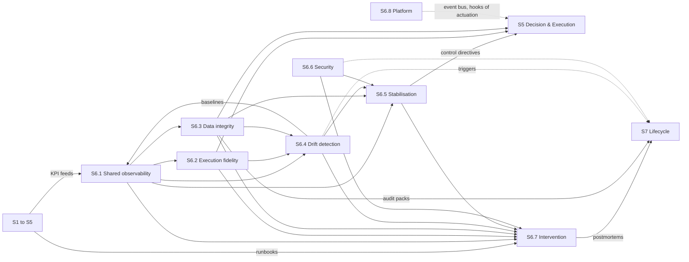

[← S5 Decision & Execution](../s5-decision-execution/README.md) · [Up: all sections](../README.md) · [S7 Lifecycle →](../s7-lifecycle/README.md)

# S6 — Monitoring

## TL;DR

Watches data, models, execution and security in production, and degrades the factory safely when something drifts.
Eight sub-sections: shared observability, execution fidelity, data integrity, drift, stabilisation, security, intervention, the platform.
Every sub-section of the factory reports here through its KPI feed; monitoring answers with signals, control directives to section 5, and lessons for lifecycle.

## Purpose

Section 6 watches the factory in production. It receives the [KPI feed](../../glossary.md#kpi-feed) of every sub-section of
sections 1 to 5, and S6.1 turns them into one [SLO catalogue](../../glossary.md#slo-catalogue): what is measured, what is promised,
what is normal. Three pages watch a risk each: live [execution fidelity](../../glossary.md#execution-fidelity) (S6.2) compares the fills
with section 4's expectations; data integrity (S6.3) keeps a replayable journal of truth and
reconciles the books with brokers and [venues](../../glossary.md#venue); [drift](../../glossary.md#drift) detection (S6.4) spots that the factory has
left the world it expects. Security (S6.6) watches identities, secrets, binaries and network.

Their [monitoring signals](../../glossary.md#monitoring-signal) go to stabilisation (S6.5), which owns the ladder of [operating modes](../../glossary.md#operating-mode) and
sends its [control directives](../../glossary.md#control-directive) to section 5; to [intervention](../../glossary.md#intervention) (S6.7), the one home of every [runbook](../../glossary.md#runbook),
which handles the incidents and turns them into learning; and to lifecycle. The platform (S6.8)
carries every flow of monitoring on its [event bus](../../glossary.md#event-bus), and manages the whole as [monitoring as code](../../glossary.md#monitoring-as-code).

The test of success: less noise and more decisions; the factory back in its safe zone fast and
without oscillation; every action journalled and explained; every incident made less likely to
happen again.

## How the section fits together

S6.1 publishes the SLO catalogue that every page of the section works from, and versions in it the
[baselines](../../glossary.md#baseline) that drift detection (S6.4) builds. Live execution fidelity (S6.2) and data integrity
(S6.3) send their control directives to section 5 within their own scope; stabilisation (S6.5) owns
the ladder of operating modes, fed by the monitoring signals of S6.1, S6.3, S6.4 and S6.6.
Intervention (S6.7) receives every signal and every runbook, and sends its [blameless postmortems](../../glossary.md#blameless-postmortem) to
lifecycle, where S6.3's [audit packs](../../glossary.md#audit-pack) and the triggers to retrain or requalify also go. The platform
(S6.8) carries all of it on its event bus, without owning any flow: its dashed edge to section 5 is
that transport, not a declared flow. Only the main flows are drawn; each page's Interfaces table
lists them all.

## Sub-sections

| ID | Sub-section | Purpose |
|---|---|---|
| S6.1 | [Single source of truth: shared observability (SLIs, SLOs & baselines)](s6.1-shared-observability.md) | One common, measurable and binding language about operations: what is measured, what is promised, what is normal. |
| S6.2 | [Live execution fidelity & operational TCA](s6.2-execution-fidelity.md) | The live quality of fills against section 4's expectations: each gap qualified, each action proven. |
| S6.3 | [Data integrity, traceability & compliance](s6.3-data-integrity-compliance.md) | A continuous, replayable journal of truth: every figure traced to its source events, reconciled, provable in audit. |
| S6.4 | [Drift & regime-change detection](s6.4-drift-detection.md) | Spots early that the factory has left the world it expects, and puts it in the right mode before anything degrades. |
| S6.5 | [Stabilisation & controlled degradation](s6.5-controlled-degradation.md) | Immediate, proportionate and reversible actions that keep the factory in its safe zone, down a ladder of modes. |
| S6.6 | [Operational security & posture (factory SecOps)](s6.6-operational-security.md) | Security under control: see early, decide fast, contain cleanly, with a trail that can be replayed. |
| S6.7 | [Intervention & learning](s6.7-intervention-learning.md) | The control tower when things go wrong, and the record that stops them from happening again. |
| S6.8 | [Observability platform & monitoring-as-code](s6.8-monitoring-as-code.md) | The single control room: one platform that captures, correlates, alerts and acts, all managed as code. |

## Before building it

What to master before building this section, and the checks that say when a builder is ready:
[its part of the knowledge map](../../knowledge-map.md#s6--monitoring).
