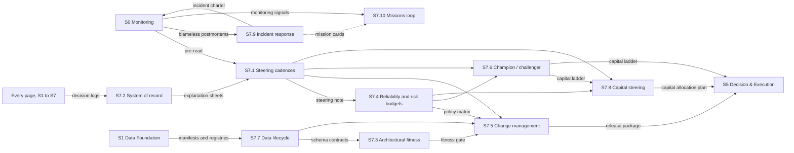

[← S6 Monitoring](../s6-monitoring/README.md) · [Up: all sections](../README.md)

# S7 — Lifecycle

## TL;DR

Steers the factory over time: the course and its budgets, the record of every decision, change, strategies and capital, data, incidents and missions.
Ten sub-sections: steering, the system of record, fitness, budgets, change, champion and challenger, data, capital, incidents, the loop of missions.
It reads monitoring's pre-read, signals and postmortems; it sends section 5 its budgets, releases and capital, and every section its missions.

## Purpose

Section 7 steers the factory over time. Where section 6 watches what happens now, lifecycle decides
what changes next, writes it down, and makes it happen in a way that can be undone. S7.1 holds the
steering reviews: on the [pre-read](../../glossary.md#pre-read) that monitoring compiles, they rule
on reliability, read the health of [alpha](../../glossary.md#alpha) and set the course. S7.2 keeps
the system of record for every decision of the factory, with a readable reason for every trade and a
[replay](../../glossary.md#replay) that matches reality.

Three pages govern change: [fitness functions](../../glossary.md#fitness-function) test every change
(S7.3); the budgets of reliability and risk say when the factory may accelerate and when it must
ease off (S7.4); [change management](../../glossary.md#change-management) releases each change as
one immutable [release package](../../glossary.md#release-package) (S7.5). Two pages govern capital:
the lifecycle of models and strategies grants each strategy its status, from
[paper trading](../../glossary.md#paper-trading) to
[champion](../../glossary.md#champion-challenger) (S7.6), and capital steering allocates within it
every week, by [capacity](../../glossary.md#capacity) and costs (S7.8). The
[data lifecycle](../../glossary.md#data-lifecycle) keeps section 1's guarantees true over time, with
[idempotent](../../glossary.md#idempotent) backfills (S7.7);
[incident response](../../glossary.md#incident-response) frames every incident and turns its
postmortems into lasting fixes (S7.9); and the loop of S7.10 turns every relevant signal into a
short, reversible, measurable mission.

The test of success: decisions that land on time and can be explained, changes that can always be
undone, capital that moves at the pace the evidence allows, and no signal left without an owner.

## How the section fits together

S7.1 sets the course at each steering review, on the pre-read that monitoring (S6.1) compiles; its
[steering note](../../glossary.md#steering-note) gives the budgets, the priorities and the release
cadence to section 5 (S5.4) and to the other pages of lifecycle. Every page of the factory writes
its [decision log](../../glossary.md#decision-log) into the system of record (S7.2), which gives
back the canonical log and the explanation of each trade. Change reaches section 5 as a release
package (S7.5), gated three ways: by the [fitness gate](../../glossary.md#fitness-gate) of S7.3, by
the [policy matrix](../../glossary.md#policy-matrix) of S7.4, which couples the
[error budget](../../glossary.md#error-budget) left and the risk budget consumed, and by the
[schema contracts](../../glossary.md#schema-contract) of the data lifecycle (S7.7), which the data
[gate](../../glossary.md#gate) of section 1 (S1.8) also enforces. Capital moves along two pages:
S7.6 grants each strategy its status and its [capital tier](../../glossary.md#capital-tier) (the
[capital ladder](../../glossary.md#capital-ladder)), and S7.8 allocates within those tiers (the
[capital allocation plan](../../glossary.md#capital-allocation-plan)); section 5 applies both.
Incident response (S7.9) frames every [intervention](../../glossary.md#intervention) of S6.7 and
turns its [blameless postmortems](../../glossary.md#blameless-postmortem) into fixes that do not
regress. The loop of S7.10 keeps one queue of missions, fed by monitoring's signals and by the
[mission cards](../../glossary.md#mission-card) of every page of lifecycle, drawn here for S7.9
only. Only the main flows are drawn; each page's Interfaces table lists them all.

## Sub-sections

| ID | Sub-section | Purpose |
|---|---|---|
| S7.1 | [Steering cadences & directional vision](s7.1-steering-cadences.md) | A short, regular ritual that rules on reliability, reads the health of alpha, sets the course, and ends in written decisions that become missions. |
| S7.2 | [Traceability, audit & explainability: the system of record for decisions](s7.2-decision-record.md) | The factory's system of record: who decided what, when, why and with what, down to the fill, with a readable reason per trade and a replay that matches reality. |
| S7.3 | [System-wide fitness & architectural evolution](s7.3-architectural-fitness.md) | What good means for the factory, encoded as living tests that let each change through, slow it or stop it, and that steer the architecture's evolution. |
| S7.4 | [Reliability budgets (SLO/SLI) & risk budgets](s7.4-reliability-risk-budgets.md) | An automatic, traceable frame that couples the error budget left and the risk budget consumed, and says when the factory may accelerate and when it must ease off. |
| S7.5 | [Change management & release strategies](s7.5-change-management.md) | Any change reaches production as one immutable release package: checked before flight, rehearsed, rolled out step by step under guard, and reversible in seconds. |
| S7.6 | [Model & strategy lifecycle (champion / challenger)](s7.6-champion-challenger.md) | A permit to operate for each strategy, and its clean withdrawal: statuses, a path through paper trading, a canary and capital tiers, the rules that move capital, and the triggers. |
| S7.7 | [Data lifecycle & provenance](s7.7-data-lifecycle.md) | Keeps section 1's guarantees true over the life of the data: a reliable record for every value, living contracts, idempotent backfills, batch and stream that converge. |
| S7.8 | [Capital, capacity & cost steering](s7.8-capital-cost-steering.md) | The right size at the right place and pace: capital, capacity and costs arbitrated at a cadence, moves smoothed, budgets respected, every choice journalled. |
| S7.9 | [Incident response & blameless postmortems](s7.9-incident-response.md) | Stabilise fast, explain clearly, correct for good: the frame every incident runs in, and the follow-through that turns each postmortem into lasting fixes. |
| S7.10 | [Monitoring-to-missions feedback loop](s7.10-monitoring-feedback-loop.md) | One queue of missions: every relevant signal becomes a short, reversible, measurable mission, run as a canary, decided on its criteria, and recorded. |

## Before building it

What to master before building this section, and the checks that say when a builder is ready:
[its part of the knowledge map](../../knowledge-map.md#s7--lifecycle).
